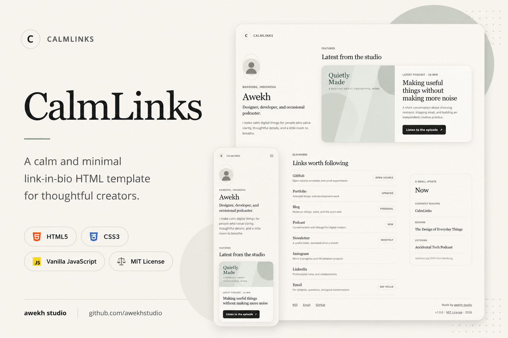
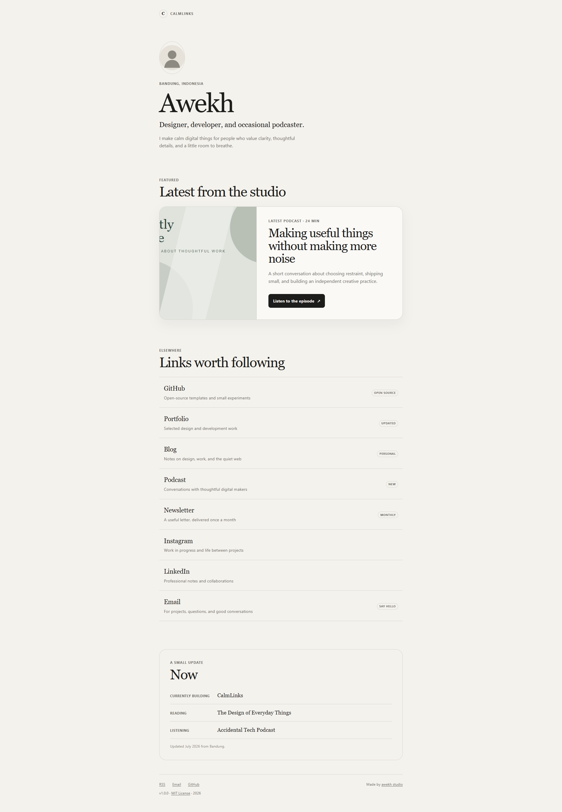
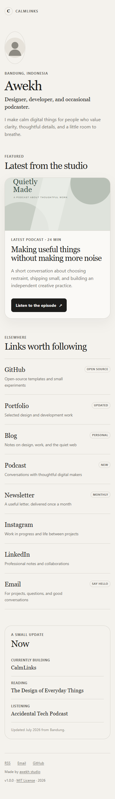

# CalmLinks

> A calm and minimal link-in-bio HTML template for thoughtful creators.



## Live demo

[View the CalmLinks demo](https://awekhstudio.github.io/calmlinks/)

> The demo URL will work after GitHub Pages is enabled for the repository.

## Overview

CalmLinks is a quiet, one-page creative homepage for developers, writers, podcasters, designers, artists, and independent makers. It introduces the person before presenting their links, gives featured work room to breathe, and turns a familiar link-in-bio format into a small, thoughtful home on the web.

It is the fourth open-source template from **awekh studio**. CalmLinks uses plain HTML, CSS, and a few lines of optional JavaScript. There is nothing to install or build.

## Features

- Identity-first profile introduction
- Large featured-content card
- Eight realistic link types
- Editable text-only Link Status Badges
- Compact “Now” section
- Local SVG avatar and artwork placeholders
- Mobile-first layout for 360, 390, 768, and 1024 px viewports
- Semantic HTML and logical heading structure
- Visible keyboard focus and skip link
- Reduced-motion support
- Copy-email enhancement with a `mailto:` fallback
- No frameworks, dependencies, external fonts, or build step

## Preview

| Desktop | Mobile |
| --- | --- |
|  |  |

The included preview images are clearly marked release placeholders. Replace them with final screenshots before publishing.

## Calm Principles

- **Identity First** — visitors meet the person before they meet a list of destinations.
- **Content Before Buttons** — the featured story has context, hierarchy, and editorial presence.
- **Quiet by Default** — restrained colors, borders, motion, and decoration keep attention on the content.
- **Accessible to Everyone** — the page remains readable, navigable, and useful across devices and input methods.

## Getting Started

### Download

1. Download the repository as a ZIP.
2. Extract the archive.
3. Open `index.html` in a browser.

### Clone

```sh
git clone https://github.com/awekhstudio/calmlinks.git
cd calmlinks
```

Open `index.html`. No local server, npm command, or installation is required.

## Customization

### Identity and content

Edit `index.html` to replace:

- `Awekh`, the profession, bio, and Bandung location
- featured article title, description, URL, and content type
- every placeholder URL containing `example.com` or `username`
- the entries in the “Now” definition list
- the email address in both the email link and `data-copy-email`
- Open Graph, canonical, and other public metadata URLs

### Avatar and featured image

Replace `assets/images/avatar.svg` and `assets/images/featured.svg`. Keep the filenames to avoid changing HTML, or update each related `src` attribute. Always provide useful alternative text.

### Link Status Badges

A badge is ordinary HTML:

```html
<span class="status">Updated</span>
```

Change the text to `NEW`, `BETA`, `MONTHLY`, `OPEN SOURCE`, or `PERSONAL`. Remove the element entirely when a link does not need a badge. JavaScript is not involved.

### Design tokens

Edit the custom properties at the top of `assets/css/style.css`:

- colors: `--color-*`
- typography: `--font-*`
- spacing: `--space-*`
- radii: `--radius-*`
- content width: `--container`

The system font stacks require no downloads and work offline.

## Accessibility

CalmLinks includes:

- semantic `header`, `main`, `section`, `article`, `nav`, and `footer` landmarks
- a keyboard-accessible skip link
- one `h1` and ordered section headings
- visible `:focus-visible` styles
- meaningful image alternatives
- an `aria-live` copy-email confirmation
- comfortable touch targets and readable text
- `prefers-reduced-motion` support
- useful content when JavaScript is disabled

When customizing, preserve heading order, write descriptive link labels, review image alternatives, and keep text contrast strong.

## Repository Structure

```text
calmlinks/
├── .github/
│   ├── ISSUE_TEMPLATE/
│   │   ├── bug_report.md
│   │   └── feature_request.md
│   └── pull_request_template.md
├── assets/
│   ├── css/
│   │   ├── reset.css
│   │   └── style.css
│   ├── icons/
│   │   └── favicon.svg
│   ├── images/
│   │   ├── avatar.svg
│   │   └── featured.svg
│   └── js/
│       └── main.js
├── preview/
│   ├── calmlinks-cover.jpg
│   ├── calmlinks-desktop.jpg
│   └── calmlinks-mobile.jpg
├── .editorconfig
├── .gitignore
├── 404.html
├── CHANGELOG.md
├── CONTRIBUTING.md
├── LICENSE
├── README.md
├── SECURITY.md
├── index.html
├── robots.txt
├── rss.xml
└── sitemap.xml
```

## Deployment

All site assets use relative paths. CalmLinks works from a domain root, a GitHub Pages project subdirectory, shared hosting, or directly from `index.html`.

### GitHub Pages

1. Push the repository to `https://github.com/awekhstudio/calmlinks`.
2. Open **Settings → Pages** in GitHub.
3. Choose **Deploy from a branch**.
4. Select `main` and `/ (root)`, then save.
5. Visit `https://awekhstudio.github.io/calmlinks/`.

No workflow file or build command is needed.

For Netlify or Cloudflare Pages, choose no framework preset, leave the build command empty, and use the repository root as the publish directory.

## License

CalmLinks is available under the [MIT License](LICENSE).

## Credits

Designed and maintained by [awekhstudio](https://github.com/awekhstudio).
